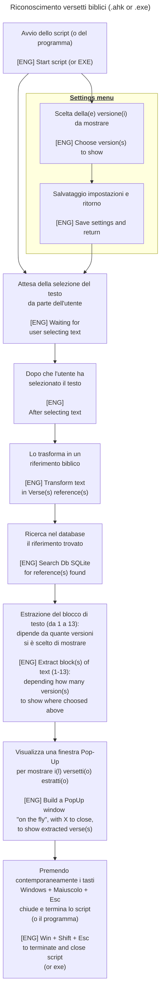

```mermaid
---
title: Riconoscimento versetti biblici (.ahk or .exe)
---
flowchart TB
    A["Avvio dello script (o del programma)<br/><br/>[ENG] Start script (or EXE)"]-->a1
    A-->B["Attesa della selezione del testo<br/>da parte dell'utente<br/><br/>[ENG] Waiting for<br/>user selecting text"]
    subgraph Settings[<u><b>Settings  menu</b></u>]
    direction LR
    a1["Scelta della(e) versione(i) da mostrare<br/><br/>[ENG] Choose version(s) to show"]-->a2["Salvataggio impostazioni e ritorno<br/><br/>[ENG] Save settings and return"]
    end
    a2-->B
    B-->D["Dopo che l'utente ha<br/>selezionato il testo<br/><br/>[ENG]<br/>After selecting text"]
    D-->E["Lo trasforma in un<br/>riferimento biblico<br/><br/>[ENG] Transform text<br/>in Verse(s) reference(s)"]
    E-->F["Ricerca nel database<br/>il riferimento trovato<br/><br/>[ENG] Search Db SQLite<br/>for reference(s) found"]
    F-->G["Estrazione del blocco di testo (da 1 a 13):<br/>dipende da quante versioni<br/>si è scelto di mostrare<br/><br/>[ENG] Extract block(s) of text (1-13):<br/>depending how many version(s)<br/>to show where choosed above"]
    G-->H["Visualizza una finestra Pop-Up<br/>per mostrare i(l) versetti(o) estratti(o)<br/><br/>[ENG] Build a PopUp window <br/>#34;on the fly#34;, with X to close,<br/>to show extracted verse(s)"]
    H-->I["Premendo contemporaneamente i tasti<br/>Windows + Maiuscolo + Esc<br/>chiude e termina lo script<br/>(o il programma)<br/><br/>[ENG] Win + Shift + Esc<br/>to terminate and close script<br/>(or exe)"]
```
